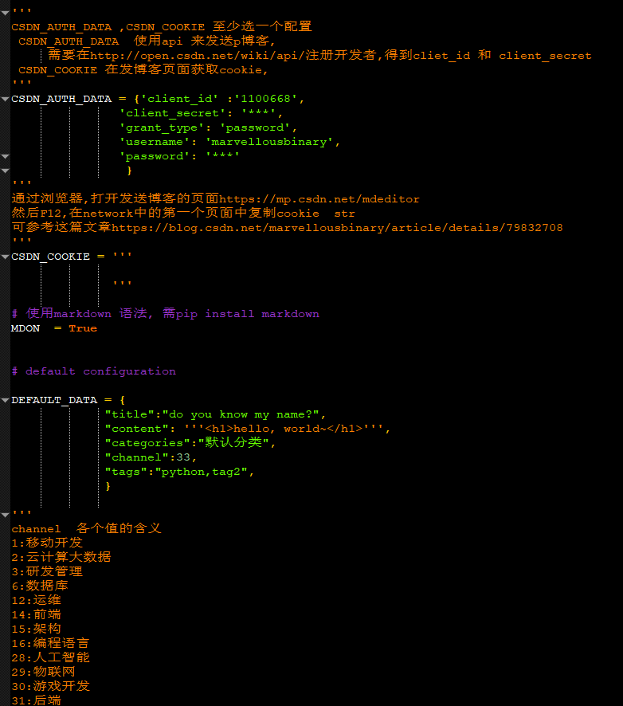

# 发表博客的工具
>利用 api 或者 cookie 发表博客，目前支持 csdn

## 为什么有它？
我在很多网站上都有博客，当发表博客时，每个网站都要更新，太累了，为了避免重复操作，所以想 b 通过程序自动发博客
同时，这个 repo 还有其他一些小工具，比如 picPost 可以检查文章中的本地图片链接，然后上传到七牛云

## 需要些什么？

### 对于 blog-sender
* python3
* python 模块
    - requests
    - markdown （可选）


### 对于 picPost（可选）
* qshell: 七牛云的一个命令行工具
* 七牛云账号

## 怎么使用？
可以看[这篇文章](https://blog.csdn.net/marvellousbinary/article/details/79832708)

```shell
$ git clone  git@github.com:mbinary/blog-sender.git
$ cd blog-sender
$ mv config.py.example  config.py
$ pip3 install markdown     可选
$ vim config.py   配置必要参数
$ python3 blogSender.py  file1  file2 ...
## 注意
用程序发表后，刚开始可能在博客首页看不见，可以用返回的 jsonc 中的 url 访问，过一段时间就可以在首页看见了。

```
这是配置参数的页面，有详细介绍



注意写文章的时候可以带上元信息,
如下
```
---
title: ABOUT
channel: 33
categories: 总结
tags: blog,me
type: original/translate/repost
---
```
如果没有，那么就是默认的了。

## 未来的可能
有需求再添加功能吧 :see_no_evil:

## 欢迎 fork & PR

## LICENCE
[MIT](LICENCE.txt)

## 联系我
* mail: </img>
* QQ  : 414313516
